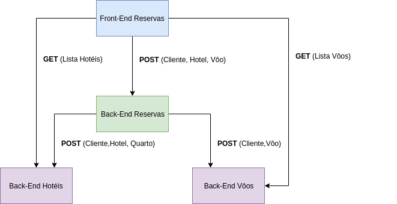

# [TBA] Travel Booking App

Part of the projet Travel Booking  App (TBA), includes a frontend to handle bookings, a backend to register the bookings to a database and a dashboard frontend displaying some stats about the bookings.

**Travel Booking App (TBA):** constitutes a project to gain familiarity with the tecnology stack [Spring](https://spring.io/) and [React](https://reactjs.org/). Where the user is able to book a travel package including Flight and Hotel room from a web page grown with React, consuming and feeding multiple REST API's, utilizing the [MySQL](https://www.mysql.com/) relational database. Includes a dashboard page using [ECharts](https://echarts.baidu.com/).



## Getting Started

To run te project, follow the next steps.

### Prerequisites

Prerequisites to run the project:

- Gradle 4.10.2;
- Java 11;
- Docker 18.X;

To enable 100% of the functionality of the application, its necessary to run the [Flight](https://github.com/Davidsksilva/Flight-Rest) and [Hotel](https://github.com/Davidsksilva/Hotel-Rest) backends.

### Executing

To run the docker container with the database:

```bash
cd /database/
docker-compose up -d
```
On the first run, its necessary to create the tables on the database:

```bash
docker exec -it database_db_1 bash
mysql
create database db_hotel;
create database db_flight;
create database db_booking;
```
To run the backend:

```bash
cd /api/
./gradlew bootRun
```

To run the frontend:

```bash
cd /public/booking-app
yarn start
```

